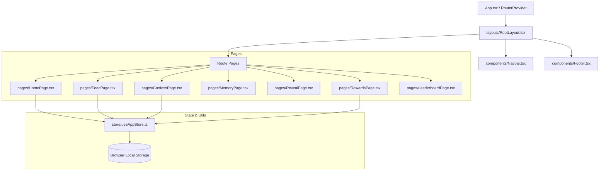

# System Design & Architecture 🏗️
## RIA's Confession Booth (ria_22)

---

## 1. System Overview & Architecture

The application is built as a single-page application (SPA) using React, styled with Tailwind CSS v4, and bundled with Vite. It features a Next.js-like routing structure utilizing React Router v7.



---

## 2. Technology Stack & Directory Structure

### 2.1 Core Stack
* **Runtime & Package Manager**: Bun
* **Framework**: React 19 (TypeScript)
* **Bundler & Dev Server**: Vite 8
* **Styling**: Tailwind CSS v4 (native `@import` and custom theme store config)
* **Routing**: React Router 7 (`createBrowserRouter`)
* **State Management**: Zustand (with local persistence)

### 2.2 Project Directory Structure
```text
src/
├── api/                  # API clients (Axios configs and backend schemas)
├── assets/               # Local static assets (images, avatars, logos)
├── components/           # UI elements & custom components
│   ├── ui/               # Radix UI primitives & accessible components
│   ├── CatPawCursor.tsx  # Mouse-tracking custom cursor layout
│   ├── CloudBackground.tsx # GSAP-animated backdrop clouds
│   ├── ConfessionCard.tsx # Reusable card layout representing confessions
│   ├── LordIcon.tsx      # Vector-based dynamic lordicon player wrapper
│   ├── LottieAnimation.tsx # Client-side Lottie JSON player
│   ├── Sticker.tsx       # Framer Motion drag-enabled scrapbook sticker
│   └── MemeCardModal.tsx # Export interface for confessions
├── layouts/              # Top-level layouts (RootLayout coordinates Lenis/GSAP)
├── hooks/                # Custom React Hooks
├── lib/                  # Utility scripts (class mergers, loggers)
├── pages/                # Route components mapping to application paths
├── providers/            # React Client Providers (e.g. QueryClientProvider)
├── store/                # Zustand global stores (useAppStore, useThemeStore)
└── types/                # Typescript types & interfaces
```

---

## 3. Data Store Schema & State Management

All client-side states (confessions list, noticed stats, task checkpoints) are maintained via a single Zustand store in `src/store/useAppStore.ts` and synced with browser `localStorage`.

### 3.1 Core Interfaces
```typescript
export interface Confession {
  id: string;
  number: number;
  category: string;
  text: string;
  riaRoast: string;
  views: string;
  hearts: number;
  commentsCount: number;
  flameScore: number;
  timeAgo: string;
  isLiked?: boolean;
  isSaved?: boolean;
  createdAt: string;
}

export interface RewardTask {
  id: string;
  title: string;
  reward: string;
  completed: boolean;
  actionText: string;
}

export interface LeaderboardItem {
  id: string;
  rank: number;
  name: string;
  handle: string;
  points: number;
  avatar: string;
  confessionCount: number;
}
```

### 3.2 Action Flow & Mutation Logic
* **`addConfession(text, category)`**: Instantiates a new confession. Resolves the next consecutive `number`, executes keyword-based analysis of the input text to match pre-defined rules, returns a customized sarcastic roast from RIA, bumps matching static notice categories (e.g. `soldEarly` counter increments if input contains `SOL`), completes Task 1, and pushes the item to the front of the feed.
* **`likeConfession(id)`**: Toggles the like state, increments/decrements heart totals, modifies the flame score, and updates the task tracker (completing Task 2 if $\ge 3$ liked items are achieved).
* **`Card UI Rendering Note`**: Visual upvoting, comment counts, and flame rating animations are disabled in `ConfessionCard.tsx`, although their underlying data fields (`hearts`, `commentsCount`, `flameScore`) are preserved in the Zustand schema for state history consistency.

---

## 4. Animation & Interaction Architecture

To implement the "kinetic" feel required by the product design, three specific libraries are utilized under a single coordinator model:

### 4.1 Lenis Smooth Scroll
Initialized globally inside `src/layouts/RootLayout.tsx`. It overrides default browser scroll physics to provide a unified momentum scroll experience, which is required to align with GSAP scroll triggers.

### 4.2 GSAP (GreenSock Animation Platform)
* **Scroll-Triggered Reveals**: Confession lists and polaroid corkboards use GSAP staggered timelines to slide, rotate, and fade into place as they enter the viewport.
* **Speech Bubble Transitions**: Ticker quotes cycle using a GSAP scale-down, swap state, and elastic scale-up timeline sequence.
* **Hacker Decrypt Effect**: Used in the *Classified Decoder* (`RevealPage`). Tapping decode starts a fast text randomizer intervals loop resolving character-by-character into readable text.

### 4.3 Framer Motion Gestures
* **Draggable Stickers**: The `Sticker.tsx` component is wrapped with a Framer Motion `<motion.div>` using:
  ```tsx
  drag
  dragConstraints={parentRef}
  dragElastic={0.15}
  whileDrag={{ scale: 1.1, rotate: 0 }}
  ```
  This enables physics-based dragging of scrapbook decals on the screen.

---

## 5. Development & Deployment Pipeline

### 5.1 Installation & Development Setup
* Install dependencies: `bun install`
* Run development server: `bun run dev`
* Run linter: `bun run lint`

### 5.2 Build & Bundle Optimization
* Build command: `bun run build`
* Outputs a static distribution bundle to `dist/` containing code-split chunks for different page routes to minimize initial bundle size.
